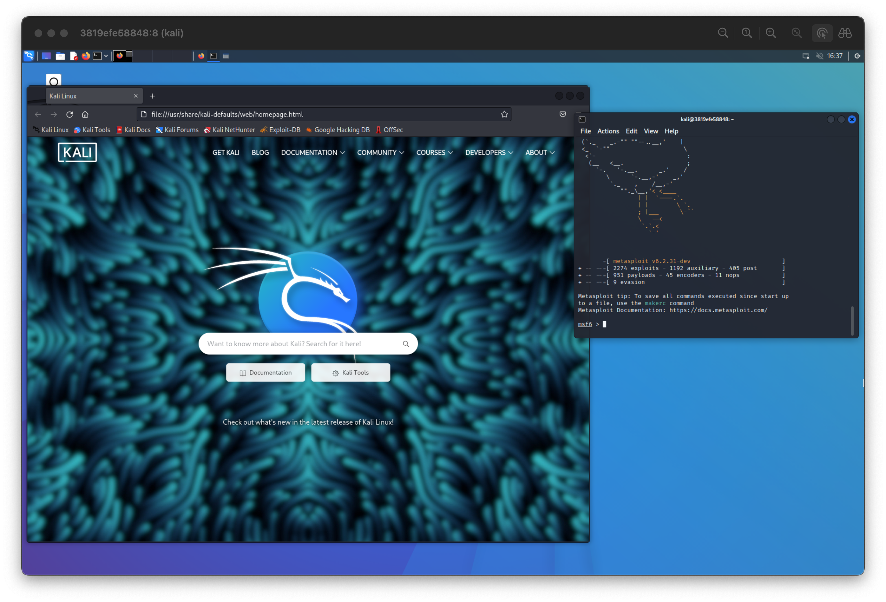

# Kali Docker on VNC
Docker is a popular tool for containerization that allows you to run applications in an isolated environment.
We can't deny how beautiful and practical it is to easily build and run kali linux. But as you working on
web pentesting, suddenly everything become dreadful. Hence, having GUI to run Burp Suite / OWASP ZAP is compulsory
in pentesting.

:::info
Docker run as root by default. So you need to be careful when using Docker.
:::

### Potential risk & Mitigation
But what if a malicious script successfully escalates to root and creates super sneaky persistence in /root,
modifies /etc/hosts, or installs something in /usr/bin? Fortunately, this won't happen in this setup as everything
except /home/kali will be disposed following shutdown. This means that any changes made outside of /home/kali will
be lost, and the container will start fresh the next time you run it.

:::warning
it's still possible to add malicious hooks in /home/kali for example .zshrc or .profile, which will be run everytime you open zsh, and surely many others places.
:::

### How to use:
1. `git clone https://github.com/Tus1688/kali-docker-vnc`
2. Create `package.txt`
3. Fill it with packages you want to install, for example: 
`tool1` 
`tool2` 
`tool3` 
4. Generate Dockerfile by running `python3 generate.py`
5. Build docker image by running `python3 build.py`
6. Run it, `python3 run.py` for cli only or `python3 vnc-run.py` to start with vnc and ssh
7. Profits 🤑
8. If you use vnc then you can kill your container with `python3 kill-container.py`

### Disclaimer 
Usage of this tool for attacking targets without prior mutual consent is illegal. It is the end user’s responsibility to obey all applicable local, state and federal laws. We assume no liability and are not responsible for any misuse or damage caused by this tool.