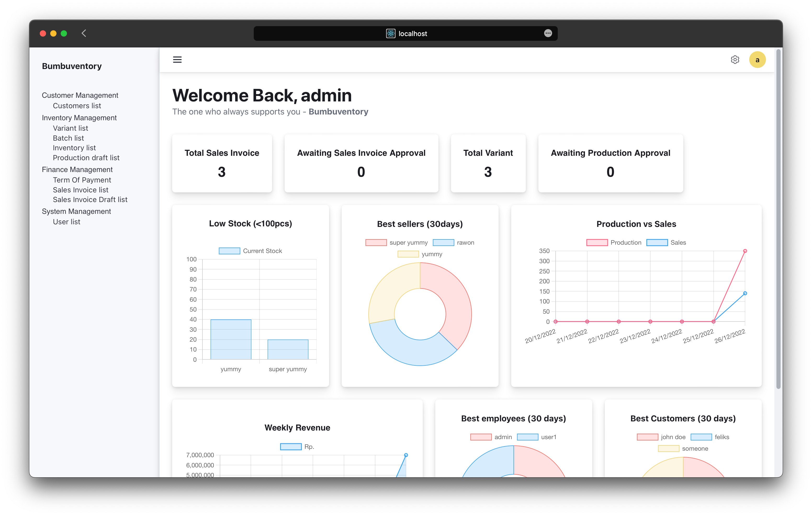
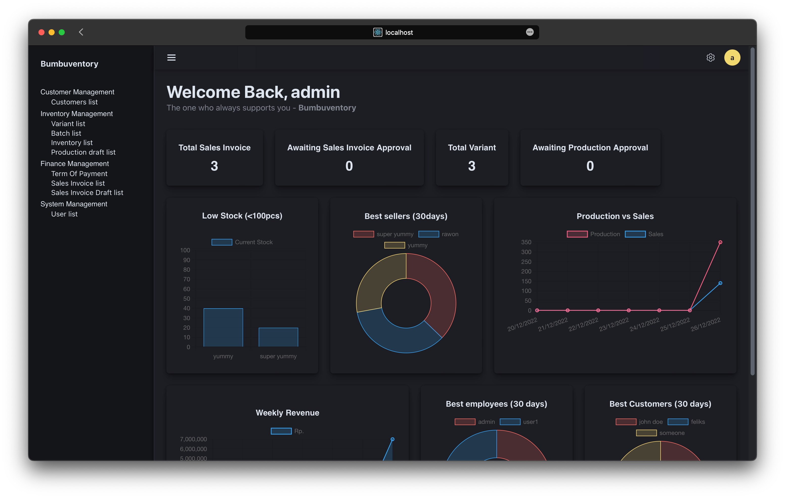
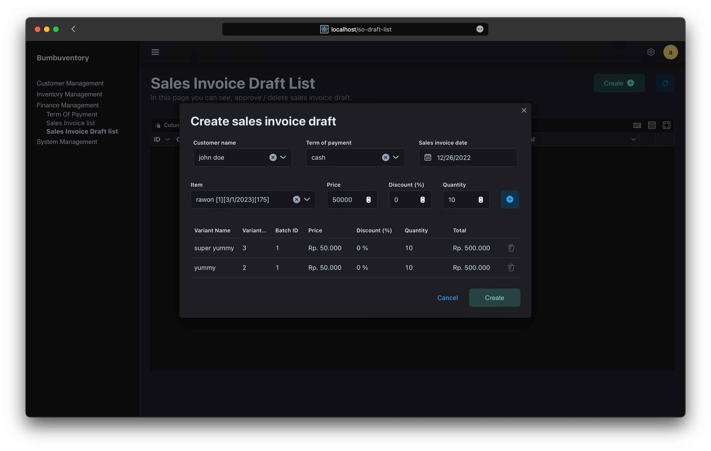
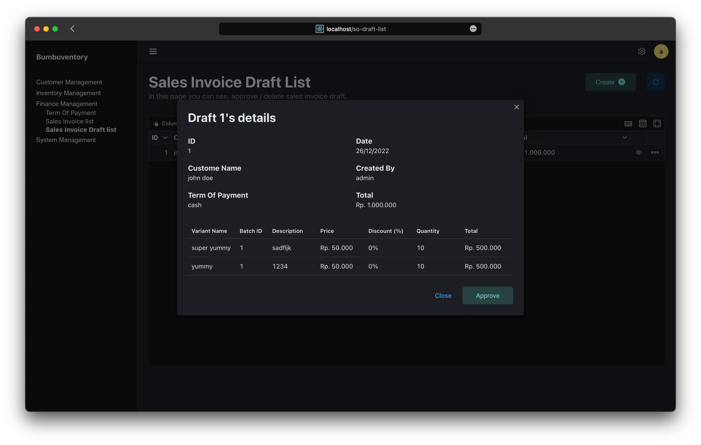
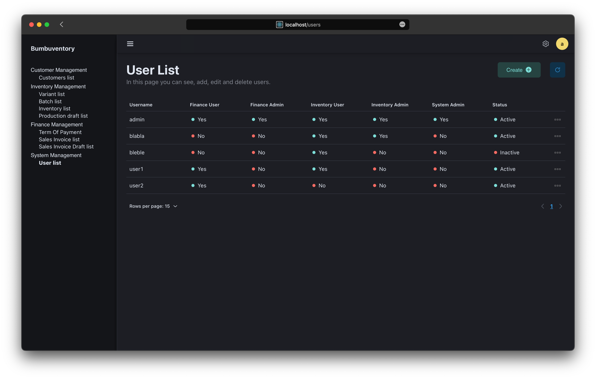
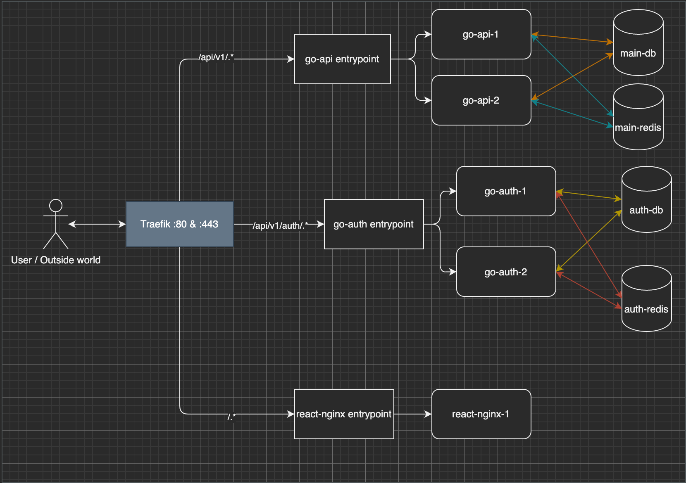

# Mini ERP

Mini erp is a inventory management system that I made for System Analysis and Design class.
It is a web application that is build with React and Gin Gonic.
It is in charge of managing the inventory of SME (Small and Medium Enterprises) and also
helps them to manage their sales and improve their business decisions by providing them
with data analytics of their sales and production records.

:::note
My apologies for not being able to share the code, the attack surface will be bigger if I do.

1.  I don't have ability to hire **professional** pentester.
2.  What I think is secure, might not be secure for others.
3.  Although I have done my best to secure the application, **I am not a security expert**.
4.  I don't have self confidence to say that this application is 100% secure (**I am not a security expert**).
:::

### Analysis Phase
At the beginning of the project, We began with interviewing the client, and then
we did a lot of research about the system that we are going to build.
Time is the most important factor in this project, so we must be able to deliver
the system as soon as possible. We also need to make sure that the system is
secure and easy to use.

Features

-   Dashboard that consist of
    -   Total Sales Invoice
    -   Awaiting Approval Sales Invoice
    -   Total Variant
    -   Total Awaiting Production
    -   Low Stock Variant
    -   Best Seller Variant
    -   Item Turnover (Production vs Sales quantity)
    -   Weekly revenue
    -   Best Customers (by amount of purchase)
    -   Best Employees (by amount of approved sales invoice)
-   Customer Management
    -   Customer (name, address, tax id, city, province, country)
        -   Create Customer
        -   Edit Customer
        -   Delete Customer
        -   Pagination (frontend and backend)
-   Inventory Management
    -   Variant (name, description)
        -   Create Variant
        -   Edit Variant
        -   Delete Variant
        -   Pagination (frontend and backend)
    -   Batch (expired date)
        -   Create Batch
        -   Edit Batch
        -   Delete Batch
        -   Pagination (frontend and backend)
    -   Production
        -   Create Production Draft
        -   Approve Production Draft
        -   Delete Production Draft
        -   Pagination (frontend and backend)
    -   Stock
        -   Pagination (frontend only)
-   Finance Management
    -   Term of Payment (name, due date)
        -   Create Term of Payment
        -   Edit Term of Payment
        -   Delete Term of Payment
        -   Pagination (frontend and backend)
    -   Sales Invoice (customer, term of payment, all items)
        -   Create Sales Invoice Draft
        -   Approve Sales Invoice Draft
        -   Reject Sales Invoice Draft
        -   Download Sales Invoice (PDF)
        -   Pagination (frontend and backend)
-   System Management
    -   User
        -   Create User
        -   Edit User Password
        -   Edit User Role
        -   Set User as Active/Inactive
        -   Pagination (frontend only)
    -   UI
        -   Change Theme
            blabla

Technical Features

-   Authentication
    -   JWT
    -   CSRF token
    -   Password Hashing
    -   Refresh Token
-   Performance
    -   Cache
        -   Redis (keep track of user session & cache length of data from database)
        -   Nginx (cache static files for frontend)
    -   Pagination
        -   Frontend (useMemo, useCallback)
        -   Backend (mysql query limit = ? and where id > ? (last_id of highest fetched data id from frontend or page_number \* page_size - page_size))
    -   Lazy Loading (React Lazy Import)
    -   Code Splitting (React Lazy Import)
-   Security (Prevent common web attacks)
    -   SQL Injection (practice secure coding)
    -   XSS (never use `dangerouslySetInnerHTML`)
    -   CSRF (use CSRF token)
    -   CORS (we are using traefik as our reverse proxy, so we don't need to worry about CORS)
    -   Session Hijacking
        -   Let's assume that user has a valid credentials, the server will generate a JWT token to give access to user to the application with these JWT claims:
            AES256 encrypted user's csrf token value (from cookie assigned before by the server),
            JTI (JWT ID) is generated with length of 10 bytes using `crypto/rand`.
            Then the server will store the (username + JTI) as a key
            and generate a refresh token with length of 32 bytes as a value in redis also using `crypto/rand`.
            The server will send the JWT token (as string) with a refresh token (as HTTP cookie + sameSite = strict) to the user.
        -   Case 1 (Attacker successfully XSS the user and steal the JWT token that is stored in session storage)
            -   Attacker parse the JWT Token
            -   Attacker need to decrypt the AES256 encrypted user's csrf token value which is impossible.
            -   `403 Forbidden!`
        -   Case 2 (Attacker successfully exploit CSRF vulnerability)
            -   Attacker need to steal the JWT token that is stored in session storage.
            -   All cookies are sent with sameSite = strict, httpOnly = true, So the attacker cannot steal csrf token, and refresh token.
            -   `403 Forbidden!`
    -   Refresh Token
        -   User casually hit API endpoint then suddenly the server return 401 unauthorized.
        -   User send a request to get a new JWT token using the expired JWT token and the refresh token.
        -   Server will check the JWT signature.
        -   Server will check if csrf token value in JWT claims and in cookie is the same or not.
        -   Server will check if the refresh token provided in httpOnly cookie is valid or not.
        -   Server send a new JWT token to the user.

Some photos

#### I love dark mode so much, so I made a dark mode for this application.

### Tech Stack

-   React (Frontend)
-   Gin Gonic (Backend)
-   MySQL (Database)
-   Redis (Cache)
-   Docker (Containerization)
-   Traefik (Reverse Proxy)
-   Rocky Linux (Server OS)

:::info
Docker run as root by default. So you need to be careful when using Docker.
:::

### Reason for choosing those tech stack

Data breaches are becoming more and more common nowadays. Secure coding practices
are very important to prevent data breaches. But I feel, it is not enough.
I think that we should seperate our application into different networks, and volumes.
So, let's say, if there is some 0day vulnerability found in our application login page,
the attacker will not be able to access our main database, because it is in a different network.
The containerization technology is very useful in this case. We can easily deploy our application
in different networks, and volumes. Unfortunately, docker daemon run as root by default and we are not sure
to use podman instead of docker. So, we need to be **extra** careful when using docker, we came up with a
solution to confine docker daemon and containers in selinux. We will talk about it later...
Now let's talk about performance, we need to make sure that our application is fast and robust
to handle a lot of requests. So, we decided to use Gin Gonic as our backend framework, because it is
very fast and lightweight, while giving us a good developer experience _(getting things done quickly)_.
We also decided to use Redis as our cache, because it is very fast and lightweight, and it is very easy to use.
Personally, I am not a big fan of MySQL, but I think it is the best choice for this project, because
my team is familiar with it, and the documentation is very good. We also decided to use React as our frontend framework,
because it is very popular, and the documentation is superb. We decided to use Traefik as our reverse proxy,
because Nginx configuration is very hard to understand, and recently Traefik is getting more and more popular.
We want to use Red Hat Enterprise Linux as our server OS, but unfortunately, it is not free, so we decided to use Rocky Linux,
which is a free and open source version of Red Hat Enterprise Linux.

Architecture Diagram

Color of arrow represent the network group that the container is in.
So, the go-api can't access the auth-db & auth-redis. The blue colored box is the
container that exposed to the internet which is the traefik container.

### Stage Of Development (without analysis phase)

-   API Design + interface design
-   Database Design
-   Backend Development
-   Frontend Development
-   Deployment
-   Penetration Testing & Performance Testing

### What did I do in this project?

I was in charge of the frontend, backend, database, and deployment of this web application.
I also did some research about the tech stack that we are going to use, and perform some
security testing on our web application. So far, I have pleased my "client" with the result of this project
which is a fully functional web application that is ready to be used in a real world scenario.

### User testing

At the near end of the development phase, I conduct a penetration testing and performance testing on our web application.
I found some minor bugs like I able to produce items with negative quantity, I able to create sales invoice with negative quantity,
But I think it is not a big deal, because it took 5 minutes to fix those issue. The important thing for me is that
Most of common web exploit will be automatically evaluated / filtered by backend.
I also found that our web application is very fast, and it can handle a lot of requests at the same time. With 10 bcrypt rounds,
our web application can handle 200 concurrent login requests for 5000 times without any problem even though the worse case scenario
takes 1.5 seconds to respond to each request, I think it is very good performance considering that we are using limited resources (2vcpu, 2gb ram).
For a real world scenario, I think we can handle more than 500 concurrent requests for any api endpoint except login endpoint,
withouth any problem. But, because we used reverse proxy, the main business logic is running in a seperate container, which is
a good thing, because high traffic on login endpoint will not affect the performance of our main business logic.

### What did I learn from this project?

I utilized this project as a learning opportunity. I learned a lot of things from this project.

-   I learned how to use Golang and Gin Gonic to build a REST API.
-   I learned new things about React, such as useCallback, useMemo, React Suspense, creating custom hooks, etc.
-   I learned how to deploy a web application behind a reverse proxy.
-   I learned how to use Redis as a cache to improve the performance of our web application.
-   I learned that I can do "unrealistic" things (such as creating fullstack web application less than 1 month) if I put my mind to it.
-   I learned in hard way that I need to be extra careful about choosing libraries that I am going to use in my project,
    because the more libraries that I depend on, the more _burden_ (dependencies hell) I have to maintain in my project.
-   I learned that ORM is not always the best choice, because it is very hard to debug when something goes wrong and 
    speaking about performance, I found that using raw SQL is faster than using ORM.
-   I learned that stateless authentication is the best way to scale but it is very hard to implement. So,
    I still use stateful authentication to validate refresh token
-   I learned how to debug selinux policy, and successfully confine docker daemon and containers in selinux.
